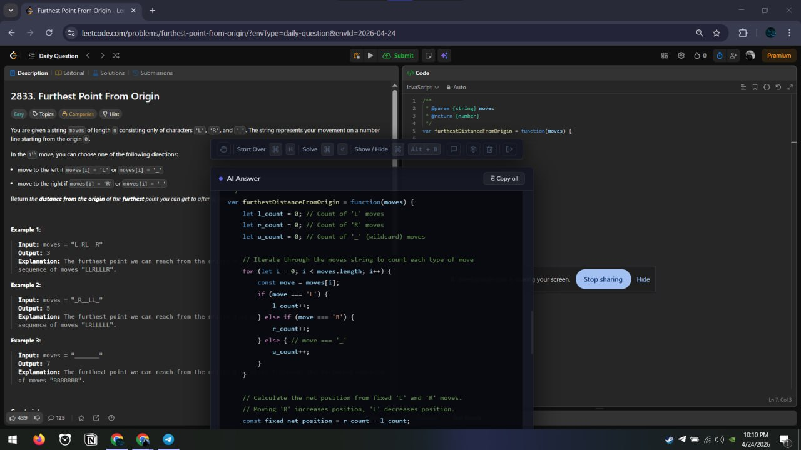

# AI Overlay

A desktop overlay that captures your screen and sends it to Google Gemini AI for instant answers. Works invisibly on top of any application.

---

## What It Does

- Captures your screen with a keyboard shortcut
- Sends the screenshot to Gemini AI for analysis
- Returns answers for coding problems, multiple choice questions, and general questions
- Has a persistent chat mode for follow-up questions

---

## Requirements

- Node.js 18 or higher
- A Google Gemini API key — get one free at https://aistudio.google.com/app/apikey
- Windows

---

## Installation

Clone the repository and install dependencies:

```bash
git clone https://github.com/your-username/ai-overlay.git
cd ai-overlay
npm install
```

---

## Running the App

Start in development mode:

```bash
npm run dev
```

Build for production:

```bash
npm run build:win
```

After building, run the installer found in the `dist/` folder.

---

## First-Time Setup

1. Launch the app — an icon will appear in your system tray
2. Right-click the tray icon and click **Settings**
3. Paste your Gemini API key and save

---

## How to Use

### Keyboard Shortcuts

| Action | Shortcut |
|---|---|
| Show / Hide overlay | `Ctrl + Alt + B` |
| Dismiss / Close | `Escape` |

### Capturing Your Screen

1. Press `Ctrl + Alt + B` to open the overlay
2. Click the capture button
3. The app takes a screenshot, hides itself from the capture, and sends it to Gemini
4. The answer appears in the result window



### Chat Mode

Use the chat input at the bottom of the overlay to ask follow-up questions. The assistant remembers the conversation within the same session.

### Tray Menu

Right-click the system tray icon to:

- Show or hide the overlay
- Open settings
- Quit the app

---

## Settings

| Setting | Description |
|---|---|
| Gemini API Key | Your API key from Google AI Studio. Stored locally, never sent anywhere except Google's API |

To update your key, right-click the tray icon, click **Settings**, then paste the new key.

To remove your key:

```
Settings > Delete API Key
```

---

## How Answers Work

The app detects what type of content is on screen and responds accordingly:

- **Coding problem** — returns a solution in Python (or your preferred language) with an explanation
- **Multiple choice question** — gives the correct option and explains why
- **General question** — provides a clear, direct answer
- **No question detected** — briefly describes what it sees on screen

---

## Supported Languages (Chat Mode)

The chat assistant automatically replies in the same language you write in — English, Russian, or Uzbek.

---

## Privacy

- The overlay window is protected from screen capture tools and recording software
- It does not appear in the taskbar
- Your API key is stored locally on your machine using encrypted storage
- Screenshots are sent directly to Google's Gemini API and are not stored by this app

---

## Troubleshooting

**The shortcut does not work**

Another application may be using `Ctrl + Alt + B`. Close other apps and try again.

**"No response" or API error**

Check that your API key is valid and that you have not exceeded your Gemini quota.

**The overlay is not visible**

Click the tray icon or press `Ctrl + Alt + B` to bring it back.

**The app opens twice**

The app prevents duplicate instances. If a second window tries to open, the original is brought to focus instead.

---

## Tech Stack

- Electron
- TypeScript
- Google Gemini 2.5 Flash API
- electron-store (local key storage)
